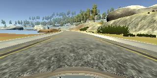
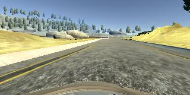
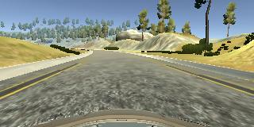
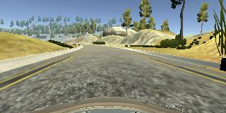
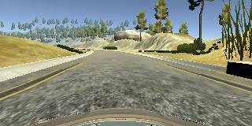
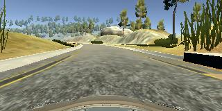

# **Behavioral Cloning** 


### Here I will consider the [rubric points](https://review.udacity.com/#!/rubrics/432/view) individually and describe how I addressed each point in my implementation.  

---
### Files Submitted & Code Quality

#### 1. Submission includes all required files and can be used to run the simulator in autonomous mode

My project includes the following files:
* network.py containing the script to create and train the model
* drive.py for driving the car in autonomous mode
* model.h5 containing a trained convolution neural network 
* readme.md summarizing the results
* run1.mp4 containing the video obtained.Also [for the ease of evaluation.](https://www.youtube.com/watch?v=g39JsRiVID8&feature=youtu.be)

#### 2. Submission includes functional code
Using the Udacity provided simulator and my drive.py file, the car can be driven autonomously around the track by executing 
```sh
python drive.py model.h5
```

#### 3. Submission code is usable and readable

The model.py file contains the code for training and saving the convolution neural network. The file shows the pipeline I used for training and validating the model, and it contains comments to explain how the code works.

### Model Architecture and Training Strategy

#### 1. An appropriate model architecture has been employed

The model I used is the NVIDIA self driving car model.

My model consists of a convolution neural network with 3x3 and 5X5 filter sizes and depths between 24 and 64 (network.py lines 56-73) 

The model includes RELU layers to introduce nonlinearity (code line 59,61,62,63,65), and the data is normalized in the model using a Keras lambda layer (code line 57).Dropout of 0.5 is also used to control overfitting(code line 66).

#### 2. Attempts to reduce overfitting in the model

The model contains dropout layers in order to reduce overfitting (network.py line 66). 

The model was trained and validated on different data sets to ensure that the model was not overfitting (code line 79). The model was tested by running it through the simulator and ensuring that the vehicle could stay on the track.

#### 3. Model parameter tuning

The model used an adam optimizer, so the learning rate was not tuned manually (network.py line 78).

#### 4. Appropriate training data

Training data was chosen to keep the vehicle driving on the road. I used a combination of center lane driving, recovering from the left and right sides of the road, recovering from left and right side of the bridge. 

For details about how I created the training data, see the next section. 

### Model Architecture and Training Strategy

#### 1. Solution Design Approach

The overall strategy for deriving a model architecture was to start already with a complicated model because getting more training data was completely in my hand(through simulator).

My first step was to use a convolution neural network model similar to the self driving car model by NVIDIA.I thought this model might be appropriate because it had reasonable number of parameters and was already tested by NVIDIA.

In order to gauge how well the model was working, I split my image and steering angle data into a training and validation set. I found that my first model had a low mean squared error on the training set but a high mean squared error on the validation set which was increasing with number of epochs. This implied that the model was overfitting. 

To combat the overfitting, I modified the model by introducing a dropout layer after the last convolution layer.


The final step was to run the simulator to see how well the car was driving around track one. There were a few spots where the vehicle fell off the track like while loosing orientation on the bridge and sharp turns just after it.To improve the driving behaviour in these cases, I drove through these places in chunks trying to recover from the lost position. 

At the end of the process, the vehicle is able to drive autonomously around the track without leaving the road.

#### 2. Final Model Architecture

The final model architecture (network.py lines 56-73) consisted of a convolution neural network with the following layers and layer sizes-

1. Input Layer (160,320,3)
2. Cropping Layer 
3. 5x5x24 Convolution layer(stride-2)
4. RELU activation
5. 5x5x48 Convolution layer(stride-2)
6. RELU activation
7. 3x3x64 Convolution layer(stride-1)
8. RELU activation
9. 3x3x24 Convolution layer(stride-1)
10. RELU activation
11. Dropout 0.5
12. Flatten Layer
13. Fully connected layer(output=100)
14. Fully connected layer(output=50)
15. Fully connected layer(output=10)
16. Fully connected layer(output=1)


#### 3. Creation of the Training Set & Training Process

To capture good driving behavior, I first recorded two laps on track one using center lane driving. Here is an example image of center lane driving:



I then recorded the vehicle recovering from the left side and right sides of the road back to center so that the vehicle would learn to regain centre position on losing it to either side of the road. These images show what a recovery looks like starting from left of the road.








I did not need to augment the data because I decided to drive a couple of laps in clockwise direction which was sufficient.

After the collection process, I had 7704 number of data points. I then preprocessed this data by normalising it. 


I finally randomly shuffled the data set and put 20% of the data into a validation set. 

I used this training data for training the model. The validation set helped determine if the model was over or under fitting. The ideal number of epochs was 10 as evidenced by getting a stable validation loss in 8,9,10 epoch. I used an adam optimizer so that manually training the learning rate wasn't necessary.
